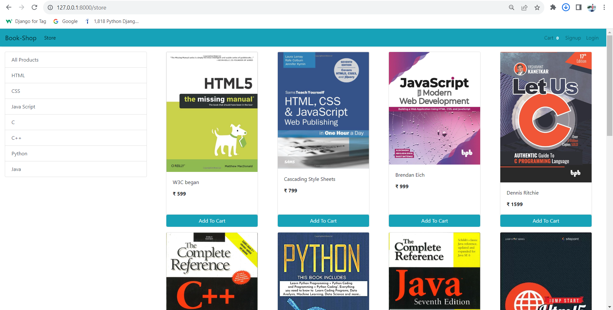

# E-commerce Website using Django
### About the project: Eshop
This project deals with developing a Virtual website ‘Online Book Store Website’. It provides the user with a list of the various Books available for purchase in the store. For the convenience of online shopping, a shopping cart is provided to the user. After the selection of the goods, it is sent for the order confirmation process. The system is implemented using Python’s web framework Django. To develop an e-commerce website, it is necessary to study and understand many technologies.

### Technologies used in the project: 
Django framework and SQLite database which comes by default with Django.

### Required Skillset to Build the Project: 
Knowledge of Python and basics of Django Framework.

# ER and Use-Case Diagrams

## Customer Interface:

1.Customer shops for a product
2.Customer changes quantity
3.The customer adds an item to the cart
4.Customer views cart
5.Customer checks out
6.Customer sends order

# Admin Interface:

1.Admin logs in
2.Admin inserts item
3.Admin removes item
4.Admin modifies item

# How to Access the project in your system

Step1- Download zip file 

Step2- Unzip the project

Step3- Open the Project in V.S code

#### Step4- Create Virtual Environment
cmd- virtualenv venv

#### Step5- Activate the venv file 
cmd- venv\Scripts\activate

#### Step6- Install the django in project
cmd- pip install django

#### Step7- Install the all packages of this project
cmd- pip install -r requirements.txt

#### Step8- Apply Migration command 
cmd- python manage.py makemigrations
cmd- python manage.py migrate

#### Step9 - Create Super User
cmd- python manage.py createsuperuser

#### Step10- Run Server Command
cmd- python manage.py runserver

open Web Browser

http://127.0.0.1:8000/

